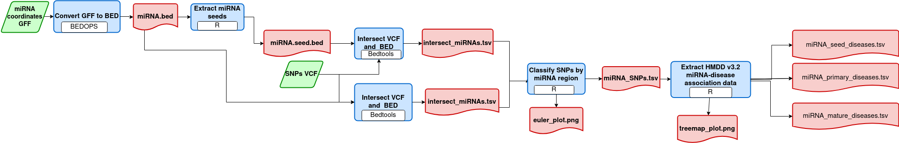
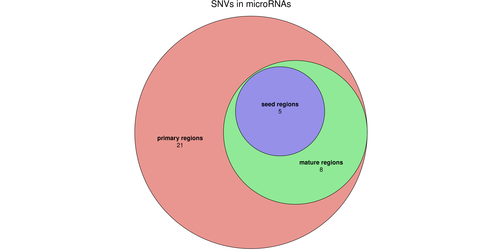
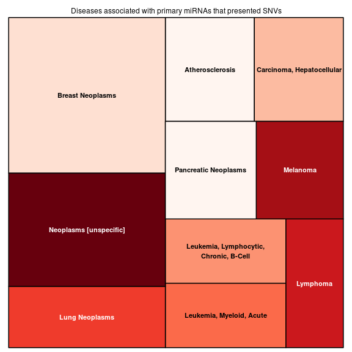

# nf-miRNA-SNPs-classify

A pipeline to classify SNPs in microRNA regions and provide an overview of diseases associated with microRNAs that present SNPs

Basic idea:

1)  Convert GFF file with miRNA coordinates to BED file.

2)  Extract miRNA seeds coordinates from BED file

3)  intersect VCF file with BED files

4)  Plot and classify SNPs by microRNA region (primary, mature and seed)

5)  Write a dataframe and plot a treemap of [HMDD v3.2](https://www.cuilab.cn/hmdd) miRNA-disease association data of the microRNAs with SNPs within the input VCF

### Workflow overview

{width="706"}

## Requirements

#### Compatible OS\*:

-   Tested in Ubuntu 20.04

#### Software:

|                                                 Requirement                                                 | Version |  Required Commands \*  |
|:-----------------------------------------------------------------------------------------------------------:|:-------:|:----------------------:|
|                                    [Nextflow](https://www.nextflow.io/)                                     | 21.04.2 |         run\*          |
|                                       [R](https://www.r-project.org/)                                       |  3.4.4  | See R scripts packages |
|                                            [bedtools](bedtools)                                             | 2.27.1  |      intersect\*       |
| [BEDOPS](https://bedops.readthedocs.io/en/latest/content/reference/file-management/conversion/gff2bed.html) | v2.4.40 |       gff2bed\*        |

\* These commands must be accessible from your `$PATH` (*i.e.* you should be able to invoke them from your command line).

#### R packages:

| Requirement | Version | Required Commands |
|:-----------:|:-------:|:-----------------:|
|    dplyr    |  1.0.7  |   mutate, %\>%    |
|   stringr   |  1.4.0  |    str_interp     |
|    vroom    |  1.5.3  |       vroom       |
|   treemap   |  2.4-3  |      treemap      |
|   eulerr    |  6.1.1  |       euler       |
|   ggplot2   |  3.3.5  |      ggsave       |

### Installation

Download compare-miRNA-pairs.nf from Github repository:

    git clone https://github.com/Ed-G655/nf-miRNA-SNPs-classify.nf.git

------------------------------------------------------------------------

#### Test

To test nf-miRNA-SNPs-classify execution using test data, run:

    bash runtest.sh

Your console should print the Nextflow log for the run, once every process has been submitted, the following message will appear:

     ======
     Basic pipeline TEST SUCCESSFUL
     ======

compare-miRNA-pairs.nf results for test data should be in the following file:

    nf-miRNA-SNPs-classify/test/data/results/

------------------------------------------------------------------------

### Usage

To run compare-miRNA-pairs go to the pipeline directory and execute:

    nextflow run nf-miRNA-SNPs-classify.nf --mirna_gff <path to input 1> --vcf <path to input 2>        [--output_dir <path to results> ]

For information about options and parameters, run:

    nextflow run nf-miRNA-SNPs-classify.nf --help

------------------------------------------------------------------------

### Example GFF input

You must use a GFF file with the human miRNA coordinates, such as the one that can be downloaded from [miRBase](https://www.mirbase.org/ftp.shtml) at the following [link](https://www.mirbase.org/ftp/CURRENT/genomes/hsa.gff3):

+------+---+--------------------------+-------+-------+---+----+---------------------------------------------------------------------------------------+
| chr1 | . | miRNA_primary_transcript | 17369 | 17436 | . | \- | ###### ID=MI0022705;Alias=MI0022705;Name=hsa-mir-6859-1                               |
+------+---+--------------------------+-------+-------+---+----+---------------------------------------------------------------------------------------+
| chr1 | . | miRNA                    | 17409 | 17431 | . | \- | ###### ID=MIMAT0027618;Alias=MIMAT0027618;Name=hsa-miR-6859-5p;Derives_from=MI0022705 |
+------+---+--------------------------+-------+-------+---+----+---------------------------------------------------------------------------------------+
| chr1 | . | miRNA                    | 17369 | 17391 | . | \- | ###### ID=MIMAT0027619;Alias=MIMAT0027619;Name=hsa-miR-6859-3p;Derives_from=MI0022705 |
+------+---+--------------------------+-------+-------+---+----+---------------------------------------------------------------------------------------+

\*Note: The chromosomal notation of the GFF file and the VCF file must match

### Example Outputs

You should get a TSV file with the SNPs from the VCF file within microRNA regions:

+-------+------------+--------+------+-------------------+----------+--------------------------------+
| chrom | pos        | ref    | alt  | mir               | strand   | type                           |
+=======+============+========+======+===================+==========+================================+
| 21    | \| 1653912 | 7 \| A | \| T |     | hsa-mir-99a |     | \+ |     | miRNA_primary_transcript |
+-------+------------+--------+------+-------------------+----------+--------------------------------+
| 21    | 45478279   | G      | A    | hsa-miR-6815-5p   | | +      | | miRNA                        |
+-------+------------+--------+------+-------------------+----------+--------------------------------+
| 21    | 41746830   | C      | T    | hsa-miR-6814-5p   | \-       | miRNA_seed                     |
+-------+------------+--------+------+-------------------+----------+--------------------------------+

Also you should get a euler plot with the number SNPs in microRNA regions:

Finally you will get a TSV file and a treemap plot of top 10 [HMDD v3.2](https://www.cuilab.cn/hmdd) miRNA-disease association data of the microRNAs with SNPs within the input VCF:

+--------------------------------------+----------------+------------------+----------+----------------+
| category                             | mir            | disease          | pmid     | description    |
+======================================+================+==================+==========+================+
| circulation_biomarker_diagnosis_down | hsa-mir-125b-2 | Breast Neoplasms | 16466964 | down-regulated |
+--------------------------------------+----------------+------------------+----------+----------------+

#### References

-   *Lu M, Zhang Q, Deng M, Miao J, Guo Y, et al. (2008) An Analysis of Human MicroRNA and Disease Associations. PLoS ONE 3(10): e3420."and "Li Y, Qiu C, Tu J, Geng B, Yang J, Jiang T, Cui Q. HMDD v2.0: a database for experimentally supported human microRNA and disease associations. Nucleic Acids Res. 2014 Jan;42(Database issue):D1070-4.*

#### Autors

José Eduardo García López
